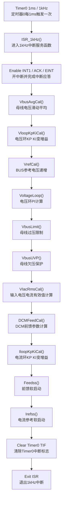
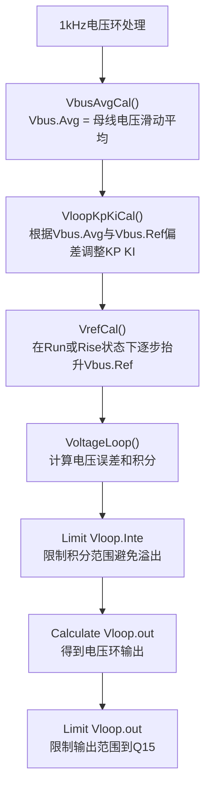
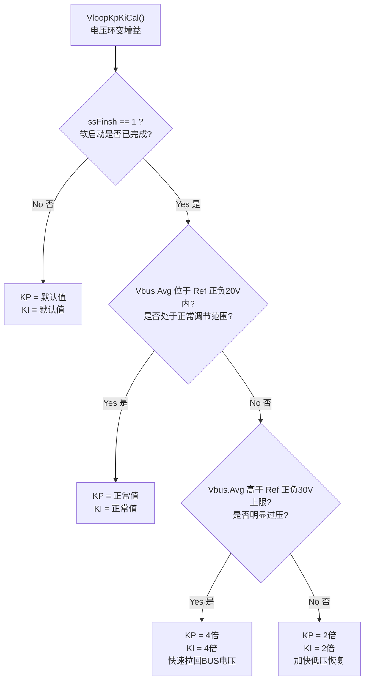
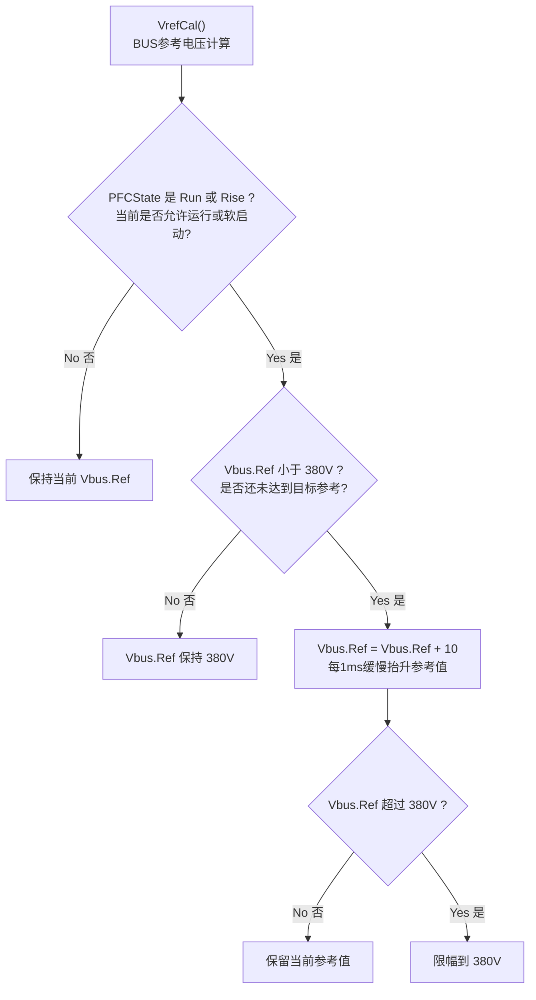
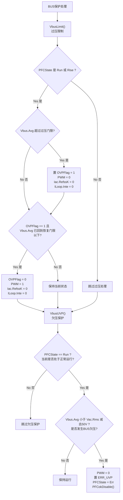
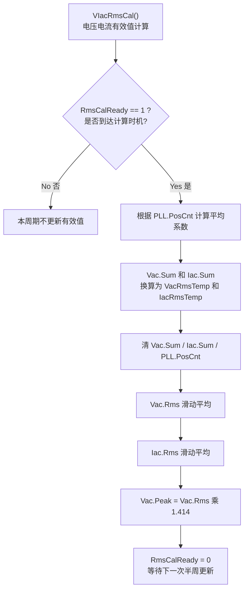
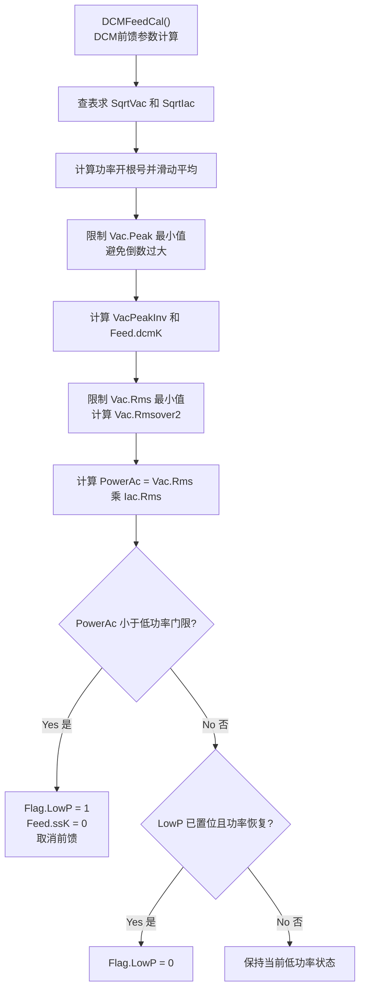
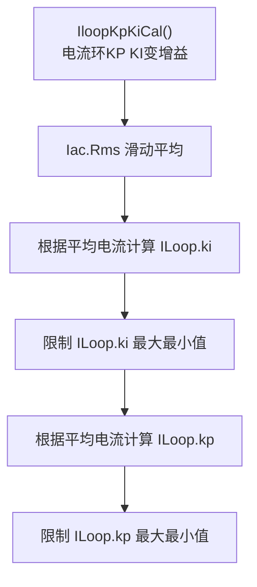
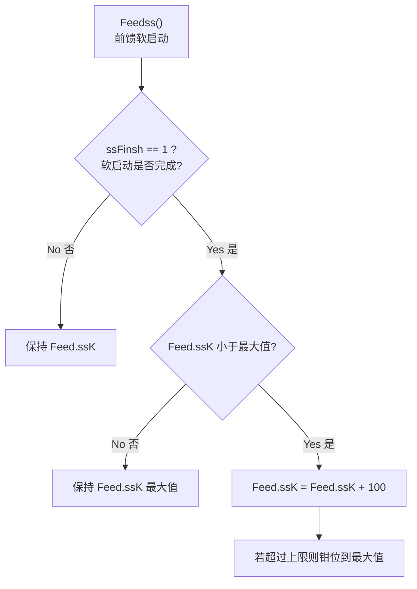
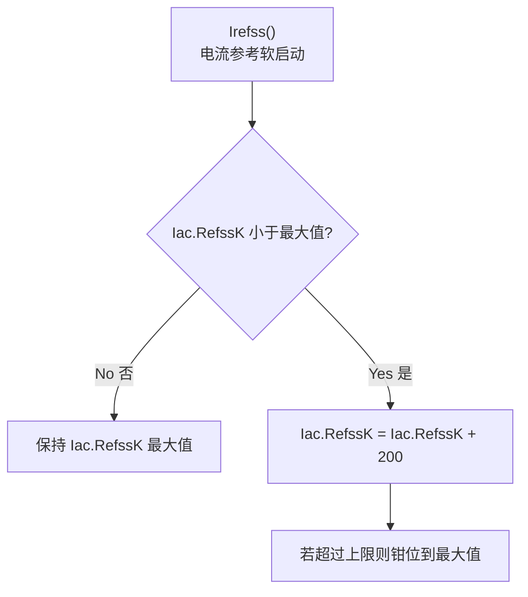

# 1kHz 流程图

说明：这份文件适配 Typora 的 Mermaid 渲染，采用较稳妥的写法：

- `flowchart TD` 单独占一行
- 节点文本使用引号包裹
- 中文说明直接写入节点中，便于截图和阅读

## 1. 1kHz 中断主流程

## 2. 电压环主流程

中文注释：

- `VbusAvgCal()`：对 ADC 采样得到的母线电压做滑动平均，降低纹波影响。
- `VloopKpKiCal()`：只有软启动结束后才根据 BUS 偏差做变增益，提高动态响应。
- `VrefCal()`：在 `Rise` 或 `Run` 状态下，将 `Vbus.Ref` 逐步增加到 380V。
- `VoltageLoop()`：执行电压环 PI 运算，输出给后续电流参考计算使用。

## 3. VloopKpKiCal 变增益流程

## 4. VrefCal 参考电压递增流程

## 5. BUS 保护流程

## 6. 有效值计算流程

## 7. DCM 前馈与电流环参数流程

## 8. 软启动系数流程

## 9. 说明

- 1kHz 中断主要负责慢速环路、BUS 保护、有效值计算、前馈参数和软启动参数更新。
- `Vbus.Ref` 在这里每 1ms 递增一次，因此它和 200Hz 状态机中的 `Rise` 状态是联动关系。
- 主电流环实时计算、PLL、采样校正和 PWM 刷新仍主要在 ADC 中断中完成。
