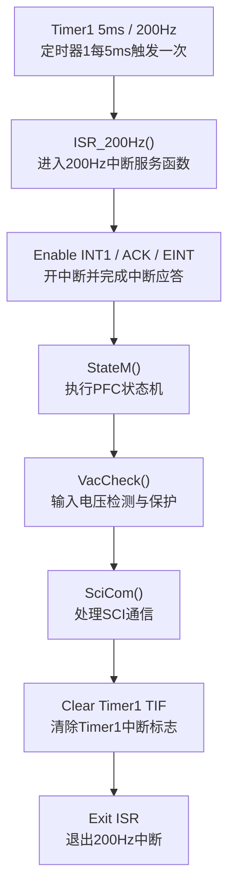
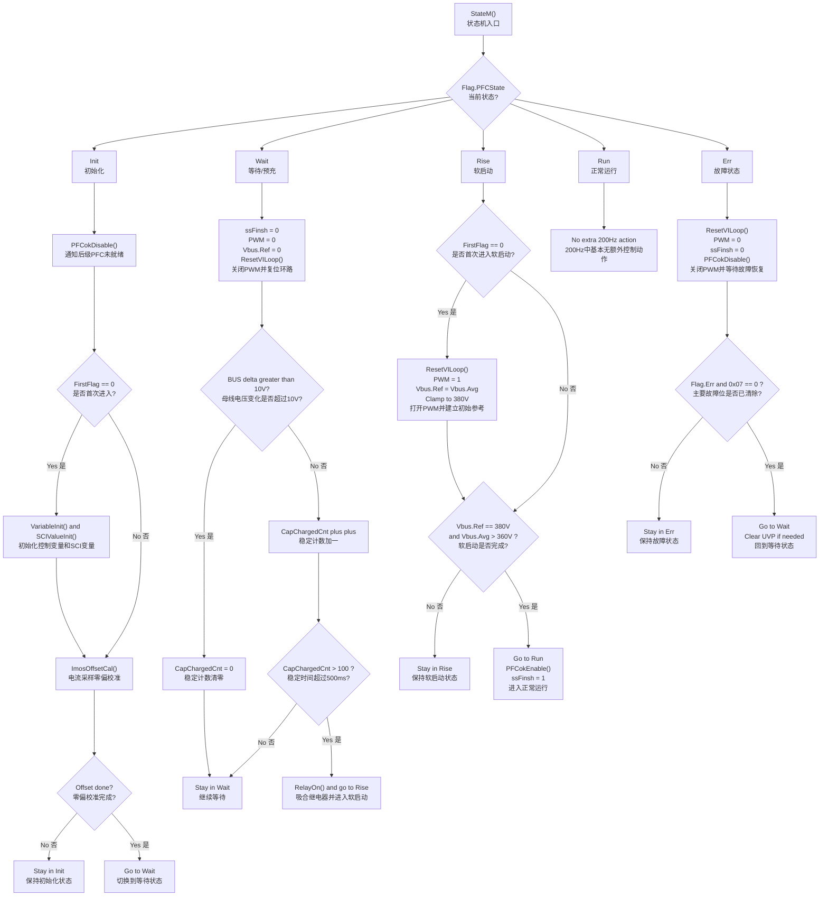
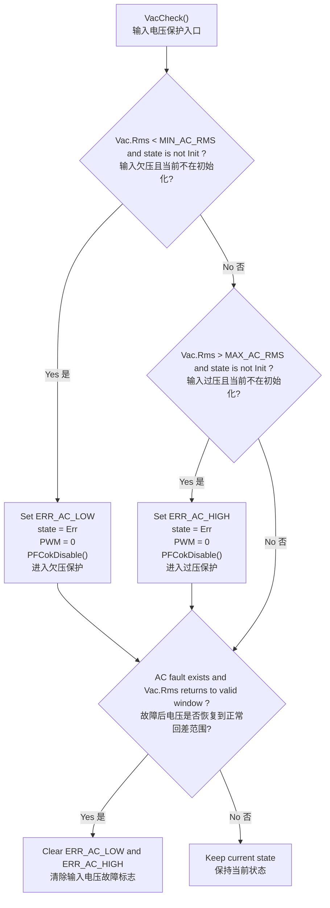
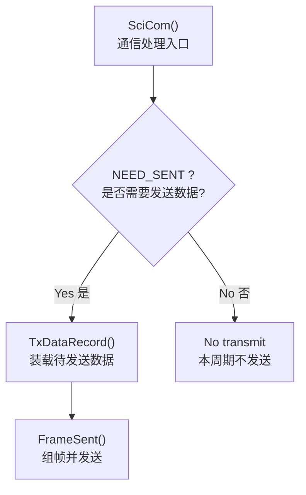

# 200Hz 流程图

说明：这份文件适配 Typora 的 Mermaid 渲染，采用更稳妥的写法：

- `flowchart TD` 单独占一行
- 节点文本使用引号包裹
- 尽量避免容易触发解析问题的紧凑写法
- 图中的英文节点后面补充了中文注释，便于和源码对应阅读

## 1. 200Hz 中断主流程

中文注释：

- `Timer1 5ms / 200Hz`：CPU Timer1 每 5ms 触发一次，对应 200Hz 慢速任务。
- `ISR_200Hz()`：200Hz 定时中断服务函数，是这一周期任务的统一入口。
- `Enable INT1 / ACK / EINT`：进入中断后先做中断应答与开总中断，允许更高优先级中断响应。
- `StateM()`：执行 PFC 状态机，包括初始化、等待、软启动、运行、故障切换。
- `VacCheck()`：检查输入电压是否欠压或过压，并在异常时拉入故障状态。
- `SciCom()`：处理与后级 DCDC 的 SCI 通信，有数据请求时进行打包和发送。
- `Clear Timer1 TIF`：清除 Timer1 中断标志位，准备下一次 5ms 周期触发。
- `Exit ISR`：退出 200Hz 中断。

## 2. StateM 状态机流程

中文注释：

- `Flag.PFCState`：状态机当前状态变量，决定本次 200Hz 周期执行哪一支流程。
- `Init`：初始化状态，主要完成变量初始化和电流采样零偏校准。
- `Wait`：等待状态，关闭 PWM，等待母线电容经整流自然充电到稳定。
- `Rise`：软启动状态，打开 PWM，建立 BUS 电压参考，等待系统进入稳定工作点。
- `Run`：运行状态，200Hz 中断中几乎不做额外控制，主控制在 ADC 和 1kHz 中断中进行。
- `Err`：故障状态，关闭 PWM，复位环路，等待故障恢复后重新回到等待状态。

各子节点说明：

- `PFCokDisable()`：通知后级当前 PFC 尚未准备好。
- `VariableInit() and SCIValueInit()`：初始化全局控制变量和 SCI 发送相关变量。
- `ImosOffsetCal()`：对电流采样偏置做平均校准。
- `Offset done?`：判断电流零偏校准是否完成，完成后才允许进入等待状态。
- `ResetVILoop()`：复位电压环、电流环及软启动相关变量，防止状态切换时残留控制量。
- `BUS delta greater than 10V?`：判断本次与上次 BUS 电压平均值变化是否超过约 10V。
- `CapChargedCnt plus plus`：当 BUS 电压变化变小，认为母线趋于充满，稳定计数器加一。
- `CapChargedCnt > 100 ?`：稳定计数超过 100 次，约等于保持 500ms 稳定。
- `RelayOn() and go to Rise`：吸合继电器，结束自然预充，进入软启动阶段。
- `Clamp to 380V`：将 BUS 参考电压限制在 380V 上限。
- `Vbus.Ref == 380V and Vbus.Avg > 360V ?`：软启动完成判据，表示参考已拉满且母线电压已接近目标值。
- `PFCokEnable()`：通知后级 PFC 已准备好，可以进入正常协同工作。
- `ssFinsh = 1`：软启动完成标志位置位。
- `Flag.Err and 0x07 == 0 ?`：判断 AC 欠压、AC 过压、硬件过流等主要故障是否都已清除。
- `Clear UVP if needed`：必要时清除 BUS 欠压保护残留标志，准备重新启动。

## 3. VacCheck 输入电压保护

中文注释：

- `VacCheck()`：输入电压保护检测函数。
- `Vac.Rms < MIN_AC_RMS and state is not Init ?`：若输入电压有效值低于欠压门限，且当前已不在初始化状态，则触发欠压保护。
- `Set ERR_AC_LOW`：置位输入欠压故障标志。
- `state = Err`：将状态机切入故障态。
- `PWM = 0`：关闭 PWM 输出，停止功率控制。
- `PFCokDisable()`：向后级输出 PFC 未就绪状态。
- `Vac.Rms > MAX_AC_RMS and state is not Init ?`：若输入电压有效值高于过压门限，则触发过压保护。
- `Set ERR_AC_HIGH`：置位输入过压故障标志。
- `AC fault exists and Vac.Rms returns to valid window ?`：若此前存在 AC 电压故障，且现在恢复到回差允许范围，则清除故障位。
- `Keep current state`：维持当前保护状态，等待后续恢复。

## 4. SciCom 通信流程

中文注释：

- `SciCom()`：200Hz 周期中的 SCI 通信处理入口。
- `NEED_SENT ?`：判断是否收到后级请求，当前是否需要回传数据。
- `TxDataRecord()`：根据当前发送类型装载待发送的数据，例如故障标志、状态机状态、输入电压、输入电流等。
- `FrameSent()`：组帧并逐字节通过 SCI 发送。
- `No transmit`：本周期没有待发送数据，直接返回。

## 5. 说明

- `Rise` 状态下 `Vbus.Ref` 的缓慢上升，实际是在 `1kHz` 中断中完成。
- 200Hz 中断主要负责状态机、输入电压保护和 SCI 通信。
- 主功率控制与环路计算主要在 ADC 中断和 1kHz 中断中执行。
- 若后续需要交论文或做答辩，可以直接把本文件中的中文注释部分整理成“流程说明”。
