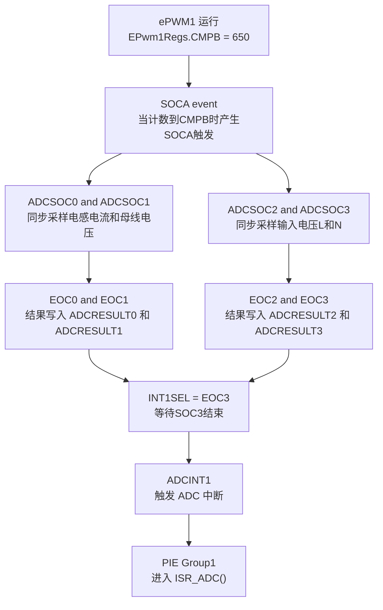
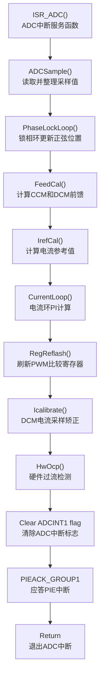
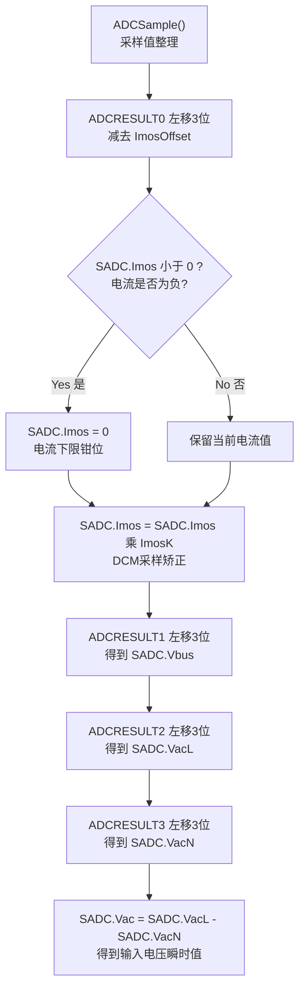
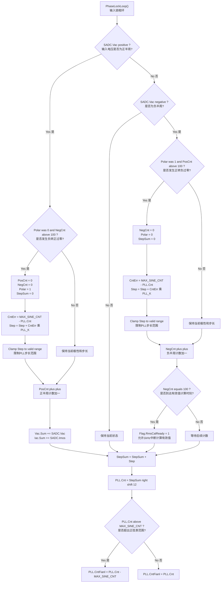
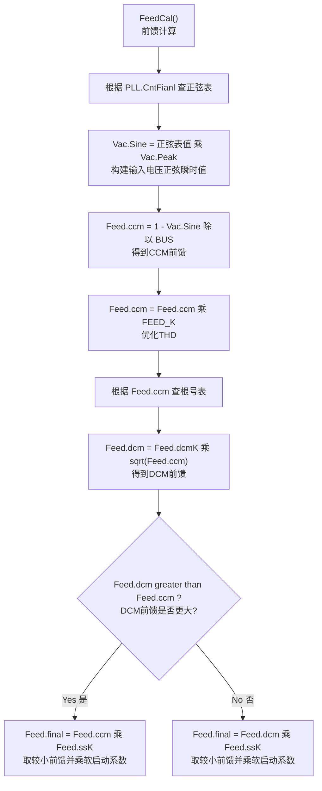
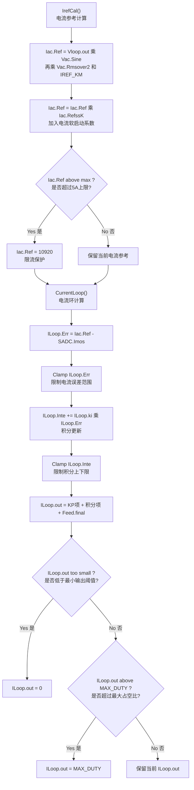
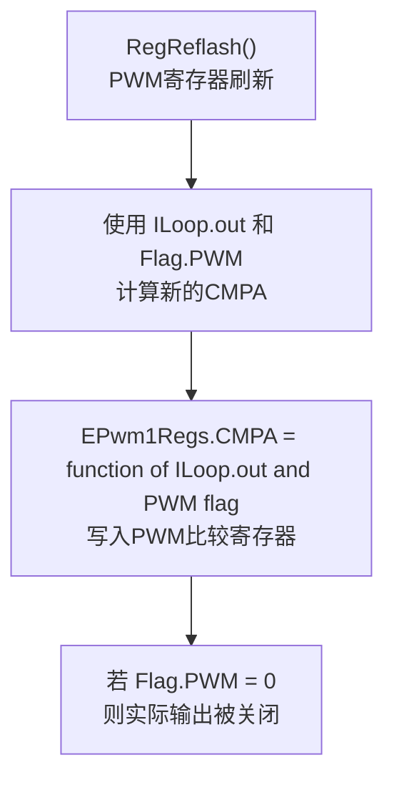
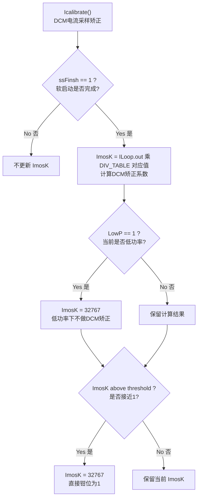
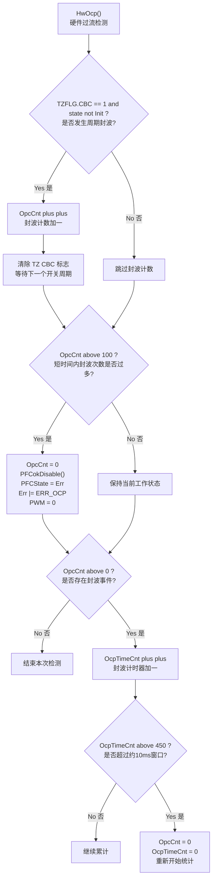

# ADC 中断流程图

## 1. ADC 中断触发链

## 2. ADC 中断主流程

## 3. ADCSample 采样处理流程

中文注释：

- `ADCRESULT0`：MOS 电流采样结果。
- `ADCRESULT1`：BUS 电压采样结果。
- `ADCRESULT2`：输入电压 L 端采样结果。
- `ADCRESULT3`：输入电压 N 端采样结果。
- 所有 ADC 结果都通过左移 3 位统一换算到 Q15 格式。
- `ImosOffset` 是初始化阶段测得的电流零偏。
- `ImosK` 是 DCM 模式下的电流采样矫正系数。

## 4. PhaseLockLoop 锁相环流程

## 5. FeedCal 前馈计算流程

## 6. IrefCal 与 CurrentLoop 流程

## 7. RegReflash 占空比刷新流程

## 8. Icalibrate 电流采样矫正流程

## 9. HwOcp 硬件过流保护流程

## 10. 说明

- ADC 中断是主实时控制中断，负责采样、PLL、电流前馈、电流参考、电流环和 PWM 刷新。
- `Vloop.out`、`Vac.Peak`、`Vac.Rmsover2`、`Feed.dcmK`、`Iac.RefssK` 等慢变量由 `1kHz` 中断维护，再在 ADC 中断中参与实时控制计算。
- `Flag.PWM` 由 200Hz 和 1kHz 中断中的状态机与保护逻辑共同决定，ADC 中断中的 `RegReflash()` 只是将结果刷新到 PWM 寄存器。
